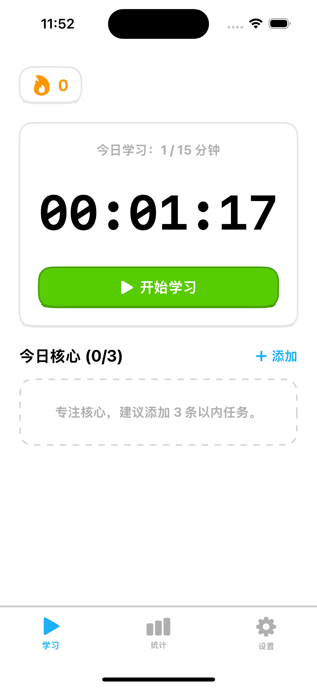
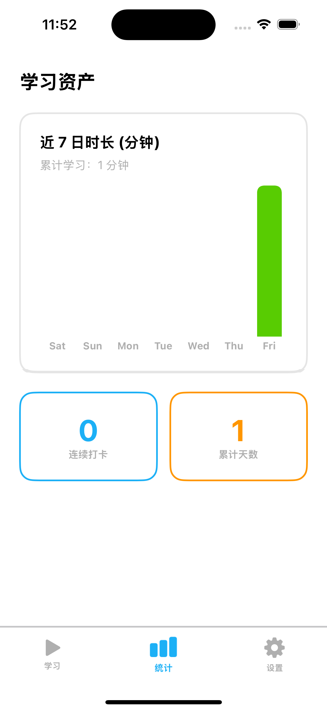
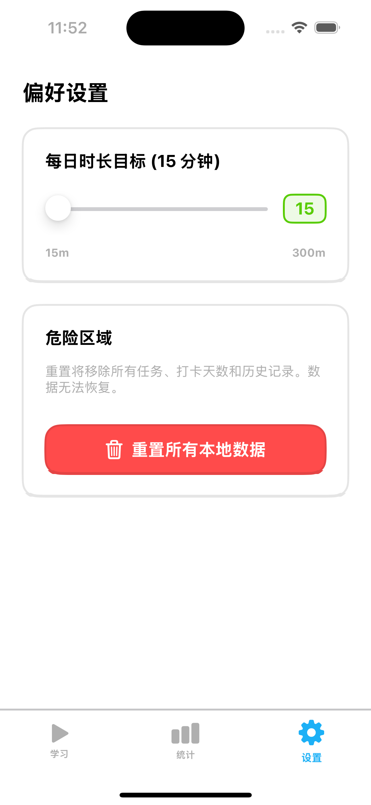
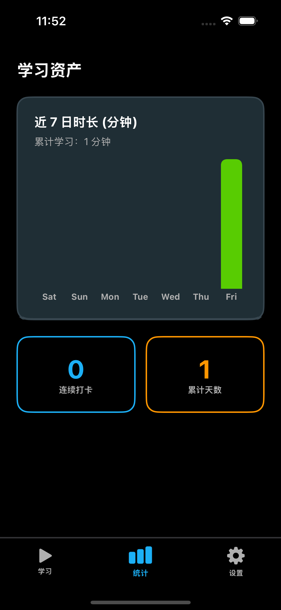
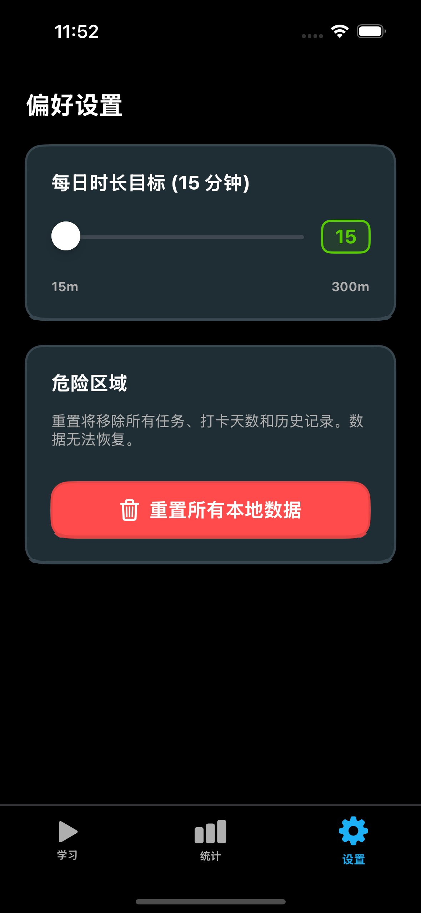

# Zero Study App

## Project Introduction

Zero Study App is an iOS application focused on learning efficiency management, helping users track study time, set learning goals, and analyze learning data.

## Features

- **Study Time Tracking**: Record daily study duration
- **Learning Goal Setting**: Set learning goals and track completion
- **Learning Data Statistics**: Visual display of learning data and trends
- **Multi-device Sync**: Support for syncing learning data across different devices
- **User-friendly Interface**: Clean and intuitive user interface design

## Screenshots





## Tech Stack

- **Development Language**: Swift
- **Development Framework**: SwiftUI
- **Data Storage**: Core Data
- **State Management**: ObservableObject

## Installation Instructions

### Prerequisites

- Xcode 15.0 or later
- iOS 16.0 or later
- macOS 13.0 or later

### Installation Steps

1. Clone the project to your local machine
   ```bash
   git clone <repository-url>
   ```

2. Open the project
   ```bash
   cd zero-study-app
   open zero-study-app.xcodeproj
   ```

3. Select the target device and run the project

## Project Structure

```
zero-study-app/
├── zero-study-app/
│   ├── Assets.xcassets/          # Application resources
│   │   ├── AppIcon.appiconset/   # Application icons
│   │   └── AccentColor.colorset/ # Application theme colors
│   ├── Components/               # Custom components
│   ├── Models/                   # Data models
│   ├── Theme/                    # Theme-related files
│   ├── Views/                    # View files
│   ├── ContentView.swift         # Main view
│   └── zero_study_appApp.swift   # Application entry point
└── zero-study-app.xcodeproj/     # Xcode project files
```

## Main Function Modules

### Home View (HomeView)
- Display today's study duration
- Quick start/pause study
- Show learning goal completion status

### Stats View (StatsView)
- Learning data visualization
- Learning trend analysis
- Weekly/monthly/yearly study reports

### Settings View (SettingsView)
- Personal information settings
- Learning goal configuration
- Application preference settings

## Contribution Guide

1. Fork this project
2. Create a feature branch
   ```bash
   git checkout -b feature/AmazingFeature
   ```
3. Commit your changes
   ```bash
   git commit -m 'Add some AmazingFeature'
   ```
4. Push to the branch
   ```bash
   git push origin feature/AmazingFeature
   ```
5. Open a Pull Request

## License

This project is licensed under the MIT License - see the [LICENSE](LICENSE) file for details
